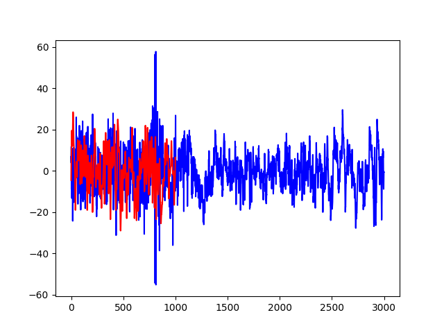
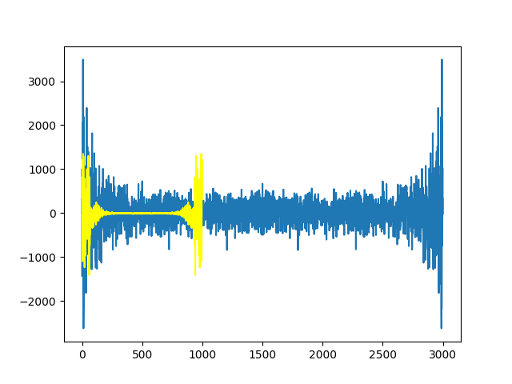
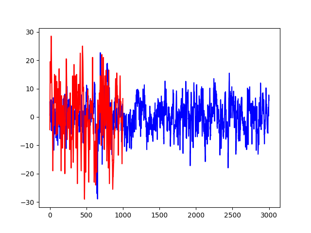
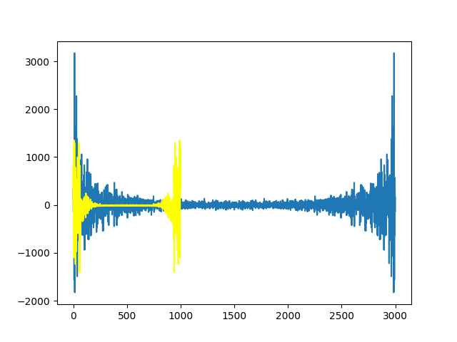

* 环境：python3.6, pytorch(gpu), scipy, sklearn
* 文件：
  * dataloader.py 数据加载，包括数据集的划分、数据的过滤和降维
  * main.py 训练及验证
  * model.py 模型
  * test.py 测试代码的文件，可以忽略
* 数据集
  * 文件树：data: {datas: [sleep\_data\_row3\*.mat, train\_1222.mat, test\_1222.mat], labels: [HypnogramAASM\_subject\*.txt]}
  * 其中train\_1222.mat和test\_1222.mat分别为新增的训练数据和测试数据
* 需要调整的：model.py中的模型，main.py中的训练速率，dataloader.py中sample函数（即降维方法）
* 目前模型为全连接层和激活层构成的网络，在验证集上的精度达到了74.30%
* 其他：3000维数据的采样频率是100Hz，说明时长为T=3000/100=30(s)，将其fft之后为3000维复向量，第k个分量表示频率为f=k\*(1/T)的谐波分量；同样1000维数据的采样频率是200Hz，T=1000/200=5(s)，fft之后第k个分量表示频率为f=k\*(1/T的谐波分量)。如图所示。

